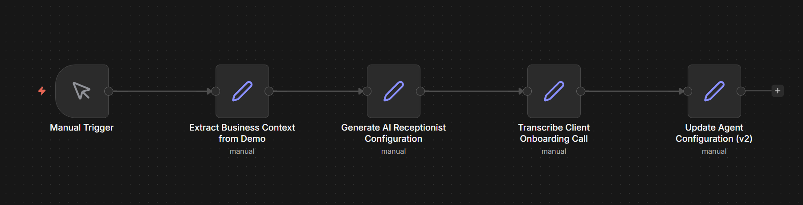

# AI Receptionist Agent Automation Pipeline



A workflow that converts business conversations into a structured AI receptionist configuration and continuously improves the agent using onboarding conversations.

This project demonstrates an automated pipeline that generates and updates an AI receptionist configuration using information extracted from business conversations.

The system processes transcripts from two stages of interaction with a business owner:

1. A demo conversation that introduces how the business operates
2. An onboarding conversation that clarifies operational details

The pipeline extracts structured business information, generates an initial AI receptionist configuration, and then updates that configuration as new information becomes available.

The goal is to simulate how an automation platform could rapidly deploy conversational agents for service businesses.

---

# System Overview

The system converts raw conversation data into a structured AI receptionist configuration through a staged automation pipeline.

The pipeline is designed to support batch processing across multiple demo and onboarding calls by iterating over the dataset directory.

```
Demo Call Transcript
    ↓
Business Context Extraction
    ↓
Agent Configuration Generation
    ↓
Onboarding Call Transcription
    ↓
Agent Configuration Update
```
Each stage of the pipeline produces structured artifacts that represent the evolving understanding of the business.

---

# Pipeline Stages

## 1. Demo Transcript Processing

The first step processes the demo call transcript and extracts operational context about the business.

The system identifies key information such as:

Business identity
Services offered
Emergency scenarios
Call routing logic
Operational notes

This information is stored as structured JSON.

Output

outputs/accounts/bens_electric/v1/memo.json

---

## 2. Agent Configuration Generation

Using the extracted business context, the system generates the configuration for an AI receptionist.

The configuration defines:

Agent role and behavior
Business services supported
Emergency call handling logic
Call routing rules
General interaction guidelines

This represents the initial version of the AI receptionist.

Output

outputs/accounts/bens_electric/v1/agent_spec.json

---

## 3. Onboarding Call Transcription

The onboarding conversation with the business owner provides additional operational details.

The system uses Whisper speech recognition to convert the onboarding call audio into text so that the information can be analyzed and incorporated into the agent configuration.

Output

data/onboarding_audio/transcript.txt

---

## 4. Agent Configuration Update

The onboarding transcript is used to refine the agent configuration.

New operational information is incorporated and a new version of the receptionist configuration is generated.

Output

outputs/accounts/bens_electric/v2/agent_spec.json

---

# Workflow Orchestration

The automation pipeline is orchestrated using n8n.

The workflow represents the lifecycle of the AI receptionist configuration:

Manual Trigger
Extract Business Context from Demo Transcript
Generate AI Receptionist Configuration
Transcribe Client Onboarding Call
Update Agent Configuration

This workflow provides a clear view of how conversational data flows through the system and produces successive versions of the agent configuration.

---

# Project Structure

```
clara-agent-automation

scripts
extract_demo.py
generate_agent_spec.py
transcribe_onboarding.py
update_agent.py

data
demo_transcripts
bens_demo.txt

onboarding_audio
audio.m4a
transcript.txt

outputs
accounts
bens_electric

v1
memo.json
agent_spec.json

v2
agent_spec.json

workflows
demo_pipeline.json
onboarding_pipeline.json
```

---

# Technologies

Python
Whisper speech recognition
JSON configuration artifacts
n8n workflow automation

---

# Agent Versioning

The system demonstrates a simple versioned agent lifecycle.

Version 1
Generated from the demo conversation.

Version 2
Updated after incorporating operational details from the onboarding discussion.

This mirrors how conversational agents evolve as businesses provide additional context about their operations.

---

## Setup and Run

1. Clone the repository

git clone https://github.com/yourusername/clara-agent-automation.git

2. Navigate to the project directory

cd clara-agent-automation

3. Install dependencies

pip install -r requirements.txt

4. Run the pipeline scripts

python scripts/extract_demo.py  
python scripts/generate_agent_spec.py  
python scripts/transcribe_onboarding.py  
python scripts/update_agent.py

## Setup and Run

1. Clone the repository

git clone https://github.com/yourusername/clara-agent-automation.git

2. Navigate to the project directory

cd clara-agent-automation

3. Install dependencies

pip install -r requirements.txt

4. Run the pipeline scripts

python scripts/extract_demo.py  
python scripts/generate_agent_spec.py  
python scripts/transcribe_onboarding.py  
python scripts/update_agent.py

# Author

**Aayush Katyal**<br>
Computer Science Engineering<br>
Focus on Artificial Intelligence and Machine Learning
